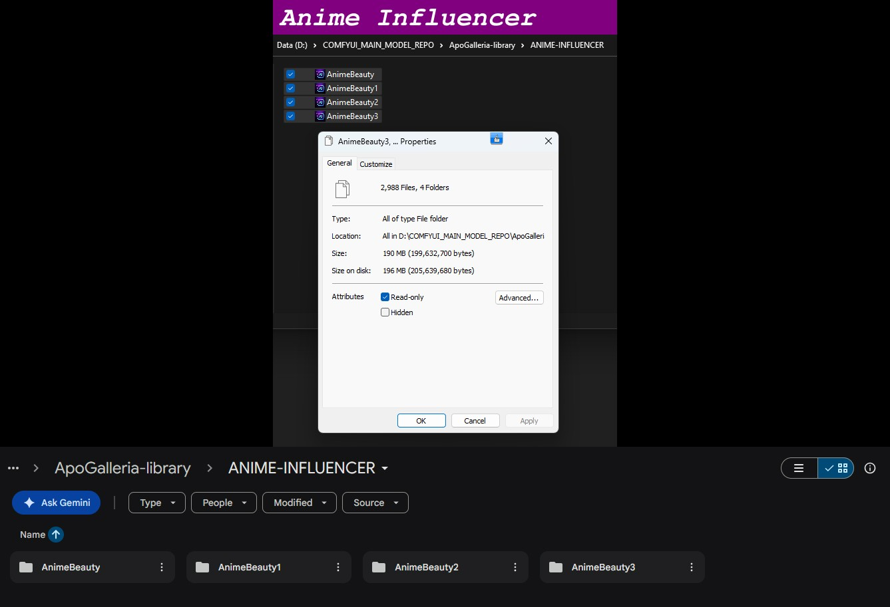

# Visual Aesthetics Library - Categories & Collections
### A breakdown of each sub-folder's contents, the categories contained within, and number of Captioned reference pairs for each category.

## ANIME-INFLUENCER
4 Categories | 2984 Captioned Pairs

You can also utilise my ApoGalleria **sibling nodes** to convert any/all captions on the fly to Natural language, or Flux2 json. No separate captioning needed, just these two extra nodes effectively increasing the power of my library 10-fold, taking you from ~50,000 captions to around ~500,000 generational possibilities.

## Instant styles, subjects & aesthetics — searchable, editable, and ready to run.

## 💬 Get the only Library you'll ever need

My library is exclusively available for purchase directly from me. Join my Discord and hit me up to get access:

### 👉 [ApoloniArt Discord](https://discord.gg/XDExAUzuZp)

---

*Made with love by [ApoloniArt](https://github.com/ApoloniArt) because I wanted inspiration on tap.* With **ApoGalleria** and this library, I never have to worry again.
Neither will you 💜
