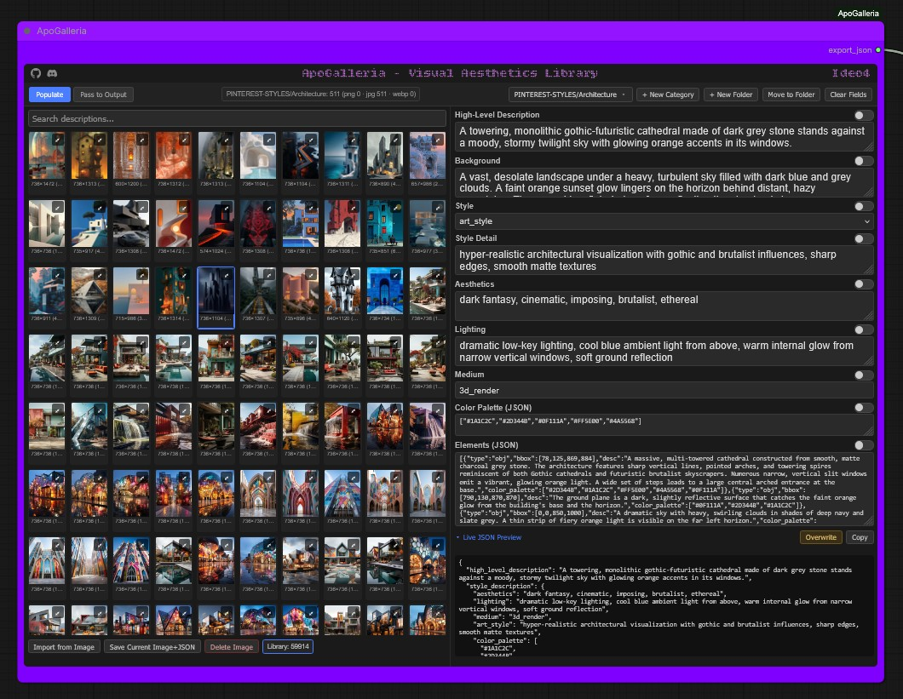

# ✨Visual Aesthetics Library✨

I adore Ideogram 4, it's compositional power and image quality is unmatched in my opinion. I'm also a purist and control freak.....I want complete creative license on every level.
So I have dedicated the last couple of months creating ***<ins>Visual Aesthetics Library</ins>*** to satiate my NEW custom node suite **[ApoGalleria](https://github.com/ApoloniArt/ApoGalleria)** Both are personal projects to fill my exact needs. 

I have decided to offer my entire **<ins>Visual Aesthetics Library</ins>** as a package to anyone who longs for inspiration on tap, like me 😊

### The largest image aesthetics library I ever created. My Library contains over 50,000 diverse image references, each captioned to the highest descriptive level of structured json currently possible, at an unmatched level of intricate detail. 
### A fully expandable, colossal collection of ready-to-go generational ideas, right at your fingertips!

Utilise my ApoGalleria **sibling nodes** to convert any/all captions on the fly to Natural language, or Flux2 json. No separate captioning needed, just these two extra nodes effectively increasing the power of my library 10-fold, taking you from ~50,000 captions to around ~500,000 generational possibilities.

## Instant styles, subjects & aesthetics — searchable, editable, and ready to run.

My library is an ever growing collection of reference images, captioned specifically for Ideogram 4. **You are NOT buying the images** — they're purely a visual reference to extract a descriptive caption. ***What you're buying is the caption itself***: a precise, reusable breakdown of style, lighting, composition and subject, that you can run instantly or edit to make your own.

**Visual Aesthetics Library** is built by, and for use with my:

- 🖼️ **[ApoGalleria](https://github.com/ApoloniArt/ApoGalleria)** — My 🆕 custom ComfyUI node suite.
- 🎨 **[ApoStudio](https://github.com/ApoloniArt/ApoStudio)** — My LLM powered node suite, and custom system prompts used to generate every caption across this entire library.

### Browse my library for inspiration in **ApoGalleria** → edit or lock fields → pass to output → generate 🫵

---

## 📚 Current collections in ***Visual Aesthetics Library***

Each folder below is the main collection, with category folders and current number of captioned pairs.

Browse the **[Folder Contents](https://github.com/ApoloniArt/Visual-Aesthetics-Library/tree/main/Library%20Contents)** here.

| Collection | Category | Captioned Pairs |
|---|---|---|
| Anime Influencer | 4 | 1,492 |
| ApoloniArt-Girls | 15 | 5,219 |
| ApoloniArt-Style | 14 | 906 |
| Artist-Styles | 5 | 709 |
| Japan-Gravure | 57 | 20,024 |
| Midjourney | 64 | 1817 |
| Pinterest-Girls | 34 | 10,975 |
| Pinterest-Style | 55 | 8,273 |
| Pinterest-Unique | 55 | 1,101 |
## Current total: 50,515 | Current size: 9.6gb [as of 28/08/2026]

## 🔍 What's Inside my Library?

- **50,000+ Image & caption pairs** — the [.jpg] image is a visual reference only; the caption is the product. The exact caption format (structured Ideo4 JSON saved as a sidecar [.txt] file).
- **Highly detailed captions** — High level description, lighting, color palette, medium, art style, full compositional breakdown, and elemental bounding box coordinates for Ideo4 JSON-based schema.
- **Manually quality-checked** — every caption is hand-verified for correct structure and syntax at the point of creation. No automated agents used for generation or QA.
- **Example dataset** — I have provided a non-cherry-picked sample dataset so you can preview caption quality before purchasing.
- **Disclaimer!** — My library contains erotic imagery, and some NSFW imagery 🔞
- **Transparency** — I hide nothing about where the images were obtained, and from whom they were created. My json captions are highly accurate & detailed, but not 100% perfect. They describe exact composition of the image, including any signatures, logos or watermarks that may be present on some images. This is the beauty of my custom node and Ideo4, as they can just be removed instantly by live editing within ApoGalleria, or bbox deletion upon population. 

## ✨ Why use my Library?

- **Never run out of ideas.** Search for a style, subject, or mood and you've got a ready-to-run starting point.
- **Mix and match.** Like the lighting of one image but not the subject? Open it in ApoGalleria, live-edit the parts you want, keep the rest, and pass it straight to output.
- **Run it instantly, or make it yours.** Use any entry as-is, or treat it as a fully editable starting template.

## 🛠️ How I made this...

- Captioned using my [ApoStudio](https://github.com/ApoloniArt/ApoStudio) nodes, LM Studio back end server, and custom system prompts created from the official Ideo4 prompting guides.
- **Visual Aesthetics Library** contains a mix of my own images, and images collected over a long, long time. You're buying my time, skills, and the captioning work — not the images themselves. I don't sell other people's work, only my own.
- My library represents a colossal, dedicated captioning effort. The breakdown for scale and time invested is as follows:
### ***Taking a conservative average of 15 seconds per caption for ~50,000 captions, total creation time for my library to date: 210 continuous GPU hours, 9 days. All done in the heat of summer. Factor in time spent generating and collecting reference images, and it is weeks of continuous work.***
- My goal is to have a captioned reference library of 100,000 pieces, covering every style imaginable.

## 📦 Requirements

To use my library as intended, you'll need:

1. **[ApoGalleria](#)** *(link coming soon)* — My custom node that stores, indexes and reads this library, and lets you browse, lock, edit, and export entries.
2. My custom sibling nodes also contained within **ApoGalleria**. These expand the use of Visual Aesthetics Library 10-fold, so all Ideo4 captions can  be converted for use on alternate architectures.
3. The matching prompt-builder or text-encode node for that library's architecture (e.g. Kijai's Ideogram4 Prompt Builder from ComfyUI-KJNodes for my main Ideogram 4.0 library).
4. Download the library and place inside ApoGalleria's **Library** folder located within the node directory.

## 💬 Get the only Library you'll ever need

My library is exclusively available for purchase directly from me. Join my Discord and hit me up to get access:

### 👉 [ApoloniArt Discord](https://discord.gg/XDExAUzuZp)

---

*Made with love by [ApoloniArt](https://github.com/ApoloniArt) because I wanted inspiration on tap.* With **ApoGalleria** and this library, I never have to worry again.
Neither will you 💜
